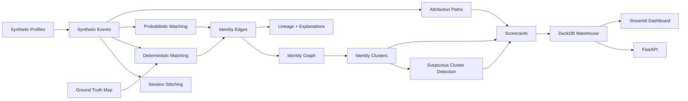
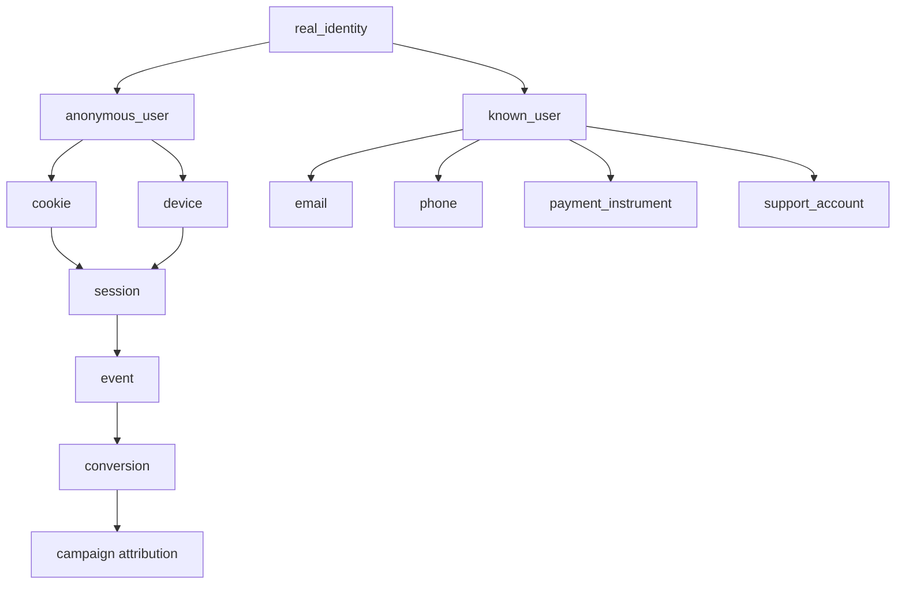
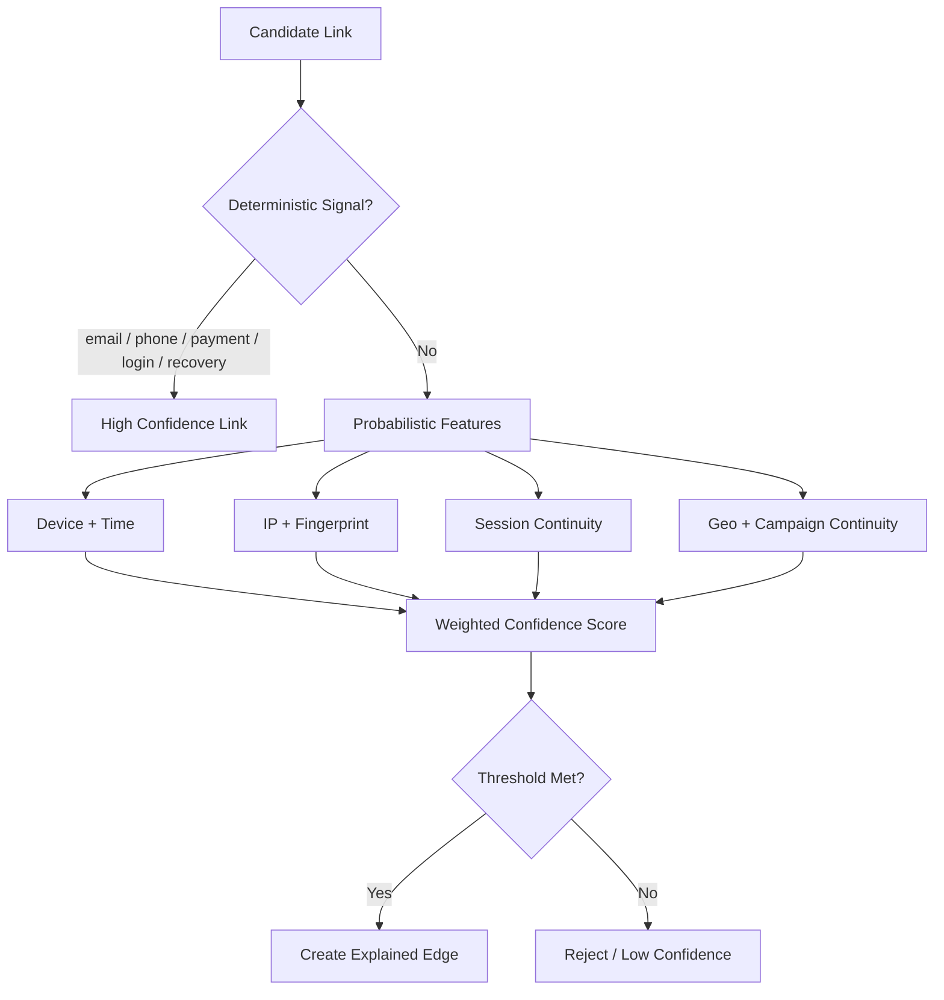
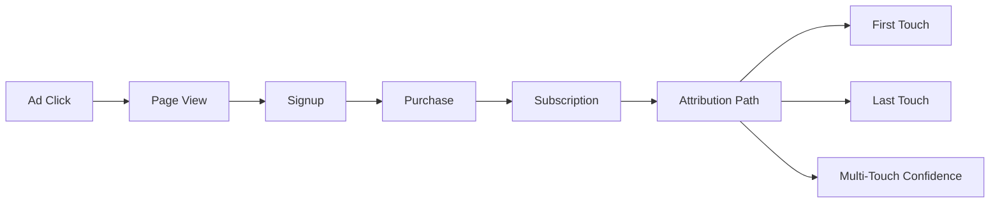
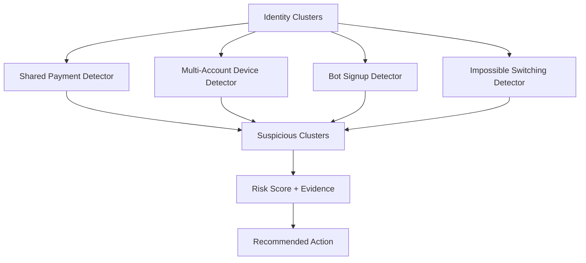

# Global Identity Resolution & Attribution Event Graph


## Executive Summary

This project simulates one of the hardest data engineering problems in large-scale consumer platforms: identity resolution.

A basic analytics pipeline asks: **"What events happened?"**

This project asks: **"Which fragmented events, devices, sessions, cookies, payments, emails, and accounts likely belong to the same real-world identity, and how confident are we?"**

Large internet platforms need to stitch together anonymous and known user activity across browsers, mobile apps, devices, ad clicks, sessions, signups, purchases, subscriptions, and support interactions.

This platform builds a synthetic identity graph, calculates match confidence, creates attribution paths, detects suspicious clusters, and produces explainable identity decisions.

**Positioning:** This project demonstrates FAANG-style data systems thinking: identity resolution, event attribution, graph-based entity matching, and fraud-aware user clustering.

## Business Problem

Identity fragmentation creates major business and technical problems:

- duplicate users in analytics
- wrong customer counts
- bad ad attribution
- incorrect campaign ROI
- broken personalization
- inaccurate churn and retention metrics
- poor fraud detection
- multi-account abuse
- shared payment abuse
- synthetic identity risk
- bot-like identity clusters
- support/account mismatch issues

Consumer platforms need a reliable identity graph that can link events across cookies, devices, sessions, emails, phone numbers, IP addresses, browser fingerprints, payment instruments, ad clicks, app installs, purchases, and support tickets.

## Why This Is FAANG-Relevant

This project maps to real infrastructure behind ads attribution, customer 360, marketplace integrity, fraud graphs, personalization, recommendation systems, growth analytics, account recovery, and trust and safety review queues.

It is not a generic ETL pipeline. It demonstrates how event-scale systems make identity decisions, preserve evidence, score confidence, and explain graph links to downstream analytics, ads, fraud, and product teams.

## Architecture



## Identity Graph Flow



## Matching Decision Flow



## Attribution Flow



## Fraud Cluster Flow



## What Was Built

- Synthetic multi-channel profile and event generation
- Known and anonymous user identity surfaces
- Device, cookie, IP, fingerprint, email, phone, payment, support, campaign, and conversion nodes
- Deterministic matching for verified identifiers and login/recovery events
- Probabilistic matching for device, session, IP, fingerprint, geo, and behavior continuity
- Identity graph construction with nodes, edges, and clusters
- Session stitching across anonymous and known behavior
- Multi-touch attribution from ad click to signup, purchase, and subscription
- Suspicious identity cluster detection for shared payment, bot-like signup, and multi-account abuse
- Explainable link lineage and graph exports
- Scorecards for identity quality, graph quality, matching accuracy, attribution, sessions, and fraud clusters
- DuckDB warehouse, FastAPI service, Streamlit dashboard, Docker, CI, and pytest coverage

## Evidence Generated by the Pipeline

| Output | Why it matters |
|---|---|
| `data/scorecards/identity_resolution_report.json/csv` | Summarizes cluster count, link confidence, deterministic/probabilistic match mix, and overall quality. |
| `data/scorecards/graph_quality_report.json/csv` | Shows graph nodes, edges, connected components, average cluster size, and graph completeness. |
| `data/scorecards/matching_accuracy_report.json/csv` | Compares resolved links to synthetic ground truth and estimates precision/recall. |
| `data/scorecards/session_stitching_report.json/csv` | Proves anonymous and known sessions were stitched with continuity metrics. |
| `data/scorecards/attribution_quality_report.json/csv` | Shows attribution path coverage, conversion lag, and attribution confidence. |
| `data/scorecards/fraud_cluster_report.json/csv` | Identifies suspicious identity clusters with evidence and recommended actions. |
| `data/graph/identity_nodes.csv` | Node inventory for the identity graph. |
| `data/graph/identity_edges.csv` | Explainable identity links with confidence scores and reason codes. |
| `data/lineage/identity_link_explanations.json` | Human-readable evidence for why identity links were created. |

## Quickstart

```bash
python -m venv .venv
source .venv/bin/activate
python -m pip install --upgrade pip
python -m pip install -r requirements.txt

python -m src.data_generation.generate_profiles
python -m src.data_generation.generate_events
python -m src.data_generation.generate_ground_truth
python -m src.pipeline.run_all
python -m pytest
python -m ruff check .
```

## API

```bash
uvicorn src.api.main:app --reload
```

Example endpoints:

- `GET /health`
- `GET /identity-summary`
- `GET /identity-clusters`
- `GET /identity-links`
- `GET /link-explanations`
- `GET /attribution-paths`
- `GET /suspicious-clusters`
- `GET /scorecards`
- `GET /graph-summary`
- `POST /resolve-identity`
- `POST /explain-link`
- `POST /simulate-event`

## Dashboard

```bash
streamlit run src/dashboard/app.py
```

Dashboard sections:

- Executive Overview
- Identity Resolution Quality
- Identity Graph Explorer
- Cluster Summary
- Match Decision Explorer
- Link Explanations
- Session Stitching
- Attribution Paths
- Suspicious Clusters
- Fraud/Trust Signals
- Scorecards

## Validation

Current V0.1 target:

- Profile generation passes
- Event generation passes
- Ground truth generation passes
- Full pipeline passes
- At least 55 tests pass
- Ruff passes
- API and dashboard launch locally

## Known Limitations

- Synthetic data only
- Local DuckDB instead of distributed warehouse
- NetworkX/local graph exports instead of graph database
- Deterministic/probabilistic baseline rules instead of large-scale ML graph embeddings
- Simulated events instead of streaming Kafka/Flink
- No cloud deployment
- No authentication
- No real ads, personalization, or fraud integration

## Future Enhancements

- Kafka/Flink event streaming
- Spark/Databricks distributed processing
- Neo4j/TigerGraph graph database
- Graph embeddings and ML-based entity resolution
- Real-time feature store integration
- Ad platform attribution simulation
- A/B testing integration
- Trust and safety review workflow
- Snowflake/BigQuery warehouse
- Airflow orchestration
- dbt transformations
- Cloud deployment
- Role-based access control

## STAR Story

### Situation

Large consumer platforms receive fragmented behavioral events across devices, cookies, sessions, ad clicks, app events, payments, and support interactions. Without identity resolution, teams cannot accurately measure users, conversions, fraud, or personalization signals.

### Task

Build a local identity resolution and attribution platform that can stitch fragmented events into identity clusters, score confidence, build attribution paths, and detect suspicious identity patterns.

### Action

Created synthetic multi-channel events, identity signals, deterministic and probabilistic matching, graph construction, session stitching, attribution paths, fraud cluster detection, confidence scoring, API endpoints, dashboards, tests, Docker, and CI/CD.

### Result

Produced a reproducible portfolio project that demonstrates FAANG-relevant data engineering skills in event-scale identity resolution, attribution, graph analytics, and trust infrastructure.
