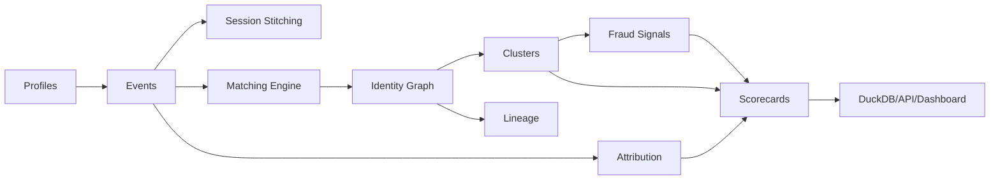

# Architecture

The platform simulates a local identity resolution control plane. Synthetic profiles and events are generated first, then stitched into sessions, matched with deterministic and probabilistic rules, converted into graph nodes and edges, clustered, attributed to conversions, scored, and exported to DuckDB, API, and dashboard layers.

