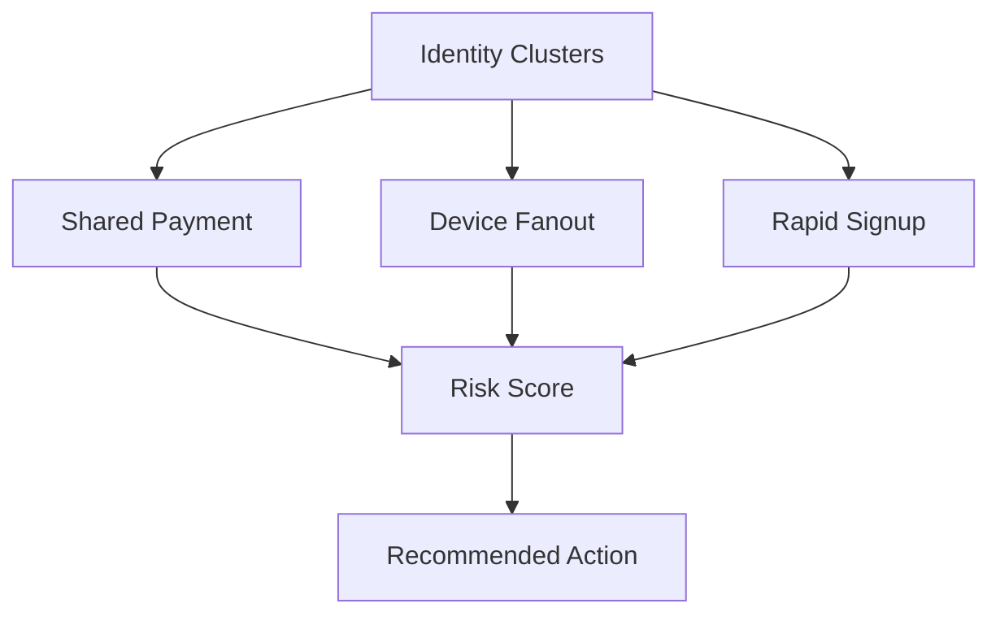

# Fraud Cluster Flow

Suspicious cluster detection flags shared payment instruments, many accounts on one device, rapid signup clusters, account recovery abuse, and other identity-risk patterns.

```mermaid
flowchart TD
    A["Identity Clusters"] --> B["Shared Payment"]
    A --> C["Device Fanout"]
    A --> D["Rapid Signup"]
    B --> E["Risk Score"]
    C --> E
    D --> E
    E --> F["Recommended Action"]
```

