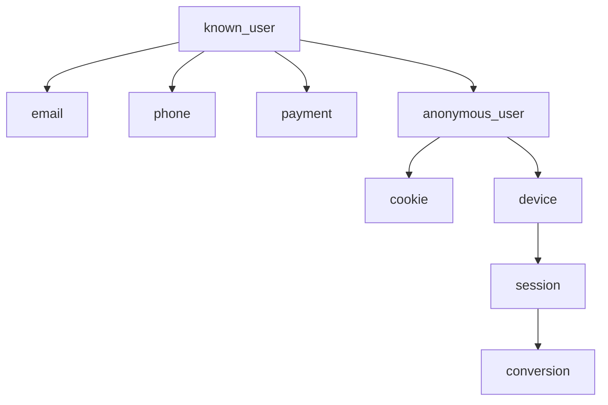

# Identity Graph Flow

The graph contains identity, account, device, browser, payment, support, campaign, session, and conversion nodes. Edges represent explainable identity links with method, confidence score, evidence, and reason codes.

