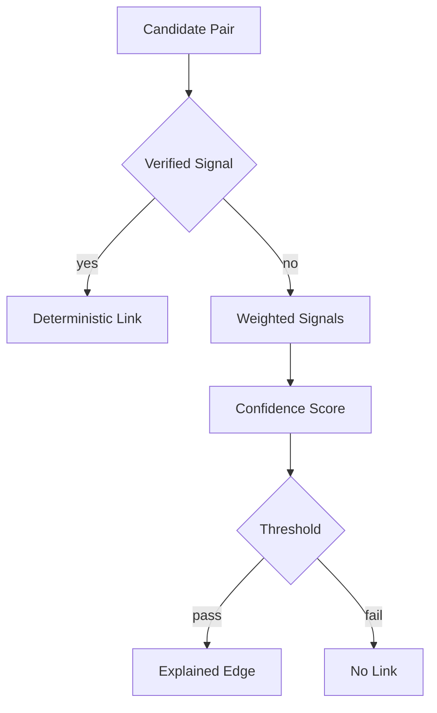

# Matching Decision Flow

Deterministic links use verified signals such as email, phone, payment, login, and account recovery. Probabilistic links use continuity patterns such as device, session, IP/fingerprint, geo, and campaign continuity.

